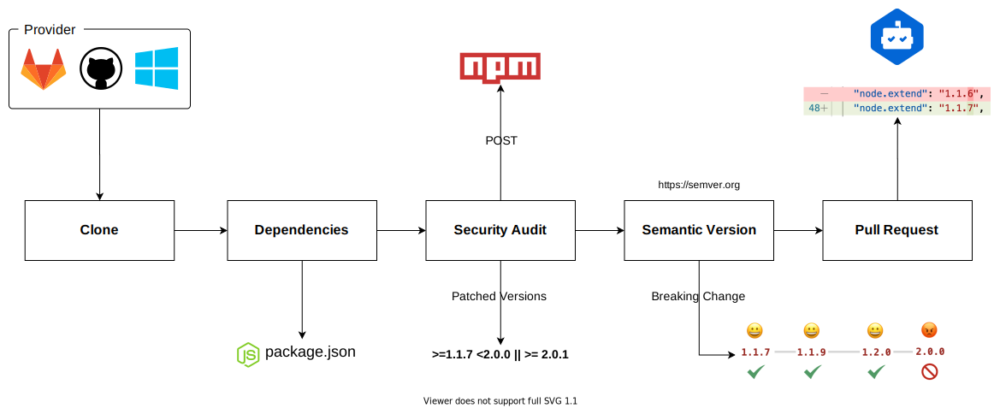

# Getting Started

**Rondabot** is a powerful agent that checks for vulnerabilities on the project's premises and submits pull requests with the best version.

The high-level flow looks like this:

<p align="center">
  
</p>

# Install

> **Ruby version**
>
> Rondabot works from ruby version `>=2.5.0`.
> Make sure you are using version `2.5.0` or higher of ruby.

To get started let's create our Gemfile:

```ruby
source "https://rubygems.org"

gem "rondabot", "~> 1.0.1"
gem "dependabot-omnibus", "~> 0.111.5"
```

run:

```bash
bundle install
```

After installation! To start using Rondabot all you need is a script looks like this:

```ruby
require "rondabot"

core = Rondabot::Core.new(
  # ...
  # the parameters. See Parameters table below
  # ...
)

# start bot
core.start()
```

## Parameters

| Name | Description |
|:------|:------|
| **provider** | Source control provider **azure**, **gitlab** or **github** |
| **organization** | Name of your organization on azure devops |
| **project** | Name of your project on azure devops |
| **repository** | Name of your project to using for clone and create pull requests |
| **access_token** | A git credentials to clone e create pull requests |
| **feed_id** | Your feed id npm/yarn on azure devops. Go to Azure Devops, your project _Artifacts_ > _Connect to feed_ > _npm_ and then you can find feed id in the url looks like `https://pkgs.dev.azure.com/your organization name/you feed id to be right here/_packaging/npm-packages/npm/registry/` |
| **github_token** | Allows passing in a GitHub access token so that the API rate limiting is not exceeded. When the repository's visibility is public, the `github_token` must be an access token with read access to the public repositories. When repository visibility is private, the `github_token` must be an access token with full control of private repositories. |

## Examples

### Azure Devops

```ruby
require "dependabot/omnibus"
require "rondabot"

core = Rondabot::Core.new(
  provider: "azure",
  organization: "Akatsuki",
  project: "Digital%20Channel",
  repository: "akatsuki-website",
  access_token: "cm9uZGluZWxsaW1vcmFpcwcm9uZGFib3Q"
  feed_id: "11db190-e3b1872-1e6e6e-c97f2dd-49253",
  github_token: "11db190e3b18721e6e6ec97f2dd49253"
)

core.start()
```

### GitHub

> **WARNING**
>
> When the repository's visibility is public, the `github_token` must be an access token with read access to the public repositories.
>
> When repository visibility is private, the `github_token` must be an access token with full control of private repositories.

```ruby
require "dependabot/omnibus"
require "rondabot"

core = Rondabot::Core.new(
  provider: "github",
  repository: "rondinellimorais/rondabot",
  github_token: "11db190e3b18721e6e6ec97f2dd49253"
)

core.start()
```

# License

MIT.